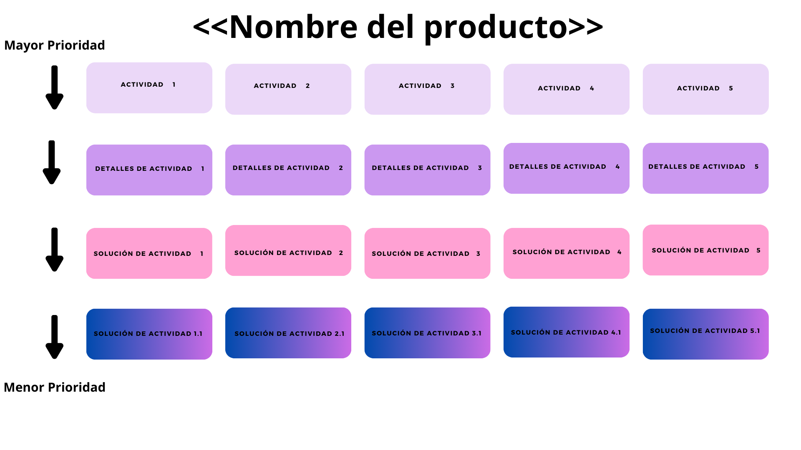

# ¿Qué es el User Story Mapping?

Según Pablo Tortorella y Damián Buonamico, es una técnica inventada por Jeff Patton que sirve para planificar de forma visual al Product Backlog.

Comunmente el Product BackLog tiene una sola dimensión, que es la lista de features; con el User Story Mapping tenemos dos dimensiones.

 Los siguientes pasos muestra cómo construir el story mapping:

## Técnica para realizar un buen Mapping

1. Identificar los distintos pasos que realizará el usuario en el servicio o producto. Se coloca todo en la primera fila, por ejemplo:

    - Actividad 1: Enterarse de la aplicación
    - Actividad 2: Identificarse en la aplicación
    - Actividad 3: Ver Perfil
    - Actividad 4: etc..

2. Identificamos los detalles, para saber de qué manera el usuario puede satisfacer una necesidad puntual que ocurre en cada actividad. Se coloca todo en la segunda fila, por ejemplo:

    - Detalles de Actividad 1: Boca a boca
    - Detalles de Actividad 1: Por publicidad de instagram
    - Detalles de Actividad 2: Registrarse digitalmente
    - Detalles de Actividad 3: --No hay--
    - Detalles de Actividad 4: etc...

Las primeras entregas del mapping no necesariamente deben estar todas llenas los detalles de Actividad, ya que es algo mínimo que se hace a primera planificación.

Esto es la versión Minima del User Story Mapping que nos va a permitir identificar qué requiere los productos para en su versión minima poder ser utilizado y de esta manera tener feedback lo antes posible.

Con esa retroalimentación es muy problable que el plan del producto sufra cambios , de ahí es por el que este tipo de artefactos suelen ser dinámicos.

El tiempo de construcción de un producto se visualiza hacia abajo, en la primera imagen se observa desde donde empieza la mayor prioridad para construir de forma mas temprana, y mas abajo lo que se va a ir construyendo despues.

Con el User Story Mapping podemos elegir desde donde tomar las soluciones de cada parte del producto y no necesariamente ir completando todo absolutamente todo lo que hace el proceso representado.

Lo importante a la hora de pensar un plan y un story mapping es hablar del User, de la persona que va estar desarrollando ciertas actividades a las cuales queremos darle soporte. Esa identificación de la persona es clave, porque es desde el punto de vista de esa persona que se va a construir el plan.

No se va a construir un plan pensando en la visión técnica o desde el punto de vista de quienes estamos construyendo la solución, sino que siempre va ser muy fácil comunicarnos con esta técnica para construirlo en su lenguaje, y no haya ambiguedad en el dominio del problema.

Entonces, identificamos a esa persona o conjunto de personas, identificamos ese proceso (cada una de las actividades de ese proceso) y se mapea, es decir, se baja con post-its (papeles adhesivos) a un artefacto de papel grande o pared, pizarrón o mesa.

El User Story Map  va permitir identificar las distintas versiones que vamos a querer entregar a nuestros usuarios de nuestros productos:

Con R1, R2,...Rn se va a deleimitar qué funcionalidades o características van a entrar dentro de un primer Release (R1) .

Si se agrega fechas a este artefacto se convierte en un Release Plan (Plan de Versiones).

Basicamente se puede leer de arriba para abajo en terminos de version 1 , version 2, version 3, etc..

La primera dos filas es la mínima viable del producto "MVP" por sus siglas en ingles.

El User Story Mapping lo que hace es mapear la historia de varios usuarios, ahí queda a criterio del equipo seleccionar un color específico arbitrario que indique que es de otro usuario.

Esto ayuda visualmente a distinguir cuales funcionalidades estan apuntadas a cuales usuarios.

Al inicio se dijo que el user story mapping era un backlog de dos dimensiones, al agregarle un color distinto (del nuevo usuario), estamos agregando una tercera dimensión.

Hay mas posibilidad de agregar otras dimensiones utilizando artefactos visuales como por ejemplo tarjetas pequeñas que acompañen el estado de ciertos elementos de este plan. Esos estados podían ser "terminado" "en proceso", etc...

Esta técnica ayuda para congeniar distintas visiones de distintas personas sobre un proyecto.

### ¿Cómo se debe hacer en la práctica?
 Se debe reunir a diferentes dueños de productos, gerentes o personas interesadas en ese producto en una misma sala y todos juntos construyen el User Story Map del producto.

De esa manera se genera una visión compartida de la totalidad del producto, esto genera un concenso a cerca de las prioridades y una visión compartida del estado actual del proyecto del producto de servicio que se está construyendo.

En esas reuniones muchas veces se invitan a los desarrolladores, a las personas que van a estar interactuando en la construcción y en el uso del proyecto del producto de manera tal de tener distinto punto de vista.

Existe herramientas digitales que pueden hacer el User Story Map pero se recomienda que sea a mano y papel porque es mucho mas versátil.